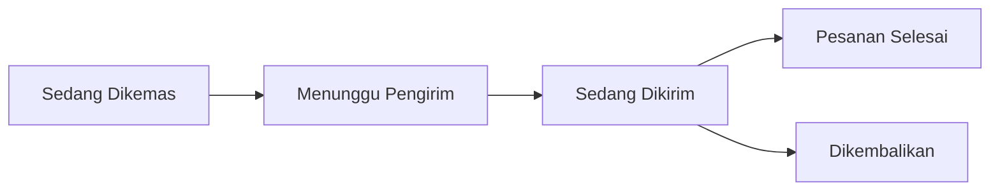

# SEAPEDIA

<div align="center">

**A full-stack multi-role marketplace with one protected order lifecycle**

[](https://seapedia-gamma.vercel.app)
[](https://seapedia-gamma.vercel.app/docs/api)
[](https://github.com/myudak/seapedia)
[](#tech-stack)
[](#about)

[Live Demo](https://seapedia-gamma.vercel.app) •
[API Reference](https://seapedia-gamma.vercel.app/docs/api) •
[Local Setup](#local-setup) •
[Demo Flow](#level-1-7-demo-flow) •
[Security](#security)

</div>


## About

SEAPEDIA is a production-style marketplace built for the **Software Engineering Academy COMPFEST 18** challenge. It is not only a product catalog: it models the complete marketplace workflow from public browsing to checkout, seller fulfillment, driver delivery, admin intervention, refunds, stock restoration, and security verification.

The app supports four operational roles in one system:

| Role | Main Workflow |
| --- | --- |
| Buyer | Browse products, manage wallet and address, use voucher or promo, checkout, and track orders |
| Seller | Manage store data, create products, process orders, and monitor income |
| Driver | Claim ready deliveries, complete jobs, and receive 80% delivery-fee earnings |
| Admin | Monitor marketplace data, manage discounts, simulate time, and handle overdue orders |

Guests can browse **32 local products** and submit application reviews. Authenticated users operate through role-protected dashboards backed by server-side authorization checks.

## Highlights

- **One shared order lifecycle** across Buyer, Seller, Driver, and Admin roles.
- **Atomic checkout** using Convex mutations, so failed validation leaves wallet, stock, cart, voucher usage, and order records unchanged.
- **Role-aware sessions** with Better Auth and active-role selection for multi-role users such as `maya`.
- **Marketplace business rules** covering wallet top-up, discounts, PPN 12%, delivery fees, SLA handling, seller income, driver earnings, refunds, and stock restoration.
- **Public product catalog** with search, category filters, sorting, pagination, SEO metadata, Open Graph cards, sitemap, robots, and Product/Offer/Breadcrumb JSON-LD.
- **Security-focused implementation** for injection resistance, XSS-safe review rendering, protected Convex functions, transaction safety, and secret hygiene.
- **End-to-end verification** with Vitest, `convex-test`, Playwright, route/API documentation parity, SEO smoke tests, and responsive checks.

## Tech Stack

| Layer | Technology |
| --- | --- |
| Frontend | Next.js App Router, React, TypeScript, Tailwind CSS |
| Backend | Convex database, validated functions, indexes, atomic mutations |
| Authentication | Better Auth through `@convex-dev/better-auth` |
| Validation | Convex argument validators and Zod HTTP schemas |
| Testing | Vitest, `convex-test`, Playwright |
| Assets | First-party generated product photography in `public/assets/products` |
| Deployment | Vercel + Convex production deployment |

## Core Features

### Public Marketplace

- Browse 32 local products across Fashion, Food, Home, and Gadget.
- View product detail pages with stable public URLs using `/products/{publicId}`.
- Search, filter by category, and sort by popular, rating, or price.
- Submit public application reviews with XSS-safe rendering.
- View SEO-ready pages with canonical metadata and structured JSON-LD.

### Buyer

- Register or log in with Better Auth.
- Top up wallet balance.
- Manage delivery address.
- Add products to cart with single-store cart enforcement.
- Checkout using one voucher or one promo.
- Track order timeline and final status.

### Seller

- Edit seeded store information.
- Create, update, and delete products.
- Process orders from `Sedang Dikemas` to `Menunggu Pengirim`.
- Monitor completed income while excluding refunded orders.

### Driver

- Claim available delivery jobs.
- Move orders from `Sedang Dikirim` to `Pesanan Selesai`.
- Receive 80% of the delivery fee after successful completion.
- Avoid double-claim issues through Convex transaction safety.

### Admin

- Manage marketplace data and discount operations.
- Simulate date advancement.
- Run idempotent overdue handling.
- Verify Buyer refunds, stock restoration, ledger entries, and `Dikembalikan` timelines.

## Business Rules

| Rule | Behavior |
| --- | --- |
| Cart scope | A cart may contain products from one store only |
| Checkout | One atomic Convex mutation handles wallet, stock, discount, order, and cart changes |
| Tax | PPN is 12% of subtotal after discount |
| Discount | One voucher or one promo per checkout; they cannot be combined |
| Voucher | Percentage-based, expiring, and usage-limited |
| Promo | Fixed-amount, expiring discount |
| Delivery fees | Instant `Rp20.000`, Next Day `Rp12.000`, Regular `Rp8.000` |
| Driver earnings | 80% of delivery fee after successful completion |
| SLA | Instant 6 hours, Next Day 1 day, Regular 3 days |
| Overdue handling | Refunds Buyer, restores stock, excludes seller income, writes timeline/ledger entries, and remains idempotent |

## Order Lifecycle



## Local Setup

Requirements:

- Node.js 20+
- pnpm

Clone and install:

```bash
git clone https://github.com/myudak/seapedia.git
cd seapedia
pnpm install
cp .env.example .env.local
```

Start Convex locally:

```bash
pnpm exec convex dev
```

On the first run, choose:

```txt
Start without an account (run Convex locally)
```

Keep this terminal running. It generates local deployment values in `.env.local` and starts Convex at:

```txt
http://127.0.0.1:3210
```

In a second terminal, configure the backend and seed the database:

```bash
pnpm exec convex env set SITE_URL http://127.0.0.1:3001
pnpm exec convex env set BETTER_AUTH_SECRET <same-value-as-.env.local>
pnpm exec convex env set SEED_ACCOUNT_PASSWORD <same-value-as-.env.local>
pnpm exec convex run seed:seed
pnpm dev:next
```

Open:

```txt
http://127.0.0.1:3001
```

The seed is idempotent. Rerunning it updates stable records without duplicating marketplace data.

For later sessions, either keep using the two-terminal setup or stop both processes and run:

```bash
pnpm dev:local
```

Do not run `pnpm dev:local` while another `convex dev` process is active.

## Environment

| Variable | Location | Purpose |
| --- | --- | --- |
| `NEXT_PUBLIC_CONVEX_URL` | Next.js | Convex client URL |
| `NEXT_PUBLIC_CONVEX_SITE_URL` | Next.js | Convex HTTP/auth URL |
| `NEXT_PUBLIC_SITE_URL` | Next.js | Canonical public origin and SEO URLs |
| `CONVEX_DEPLOYMENT` | CLI | Selected Convex deployment |
| `SITE_URL` | Convex | Origin trusted by Better Auth |
| `BETTER_AUTH_SECRET` | Convex | Better Auth signing secret, at least 32 characters |
| `SEED_ACCOUNT_PASSWORD` | Convex/local shell | Development-only seed password |

Never commit `.env.local`, deployment keys, or production secrets.

## Demo Accounts

For the supplied local setup:

```env
SEED_ACCOUNT_PASSWORD=seapedia123
```

| Username | Roles |
| --- | --- |
| `admin` | Admin |
| `maya` | Buyer, Seller, Driver |
| `seller` | Seller |
| `buyer` | Buyer |
| `driver` | Driver |

`maya` must choose an active role for each new session. Every private Convex function checks identity, active session role, and resource ownership again on the server.

## Level 1-7 Demo Flow

1. As a guest, browse `/products`, open a product, and submit an application review on `/`.
2. Register a Buyer account, or log in as `maya` to demonstrate active-role selection and protected dashboards.
3. Log in as `seller` to edit the seeded store and create, update, or delete a product.
4. Log in as `buyer`, top up the wallet, manage an address, add a product, and checkout with voucher `HEMAT12`.
5. Log in as `seller` and process the new order from `Sedang Dikemas` to `Menunggu Pengirim`.
6. Log in as `driver`, take the job, complete it, and verify the 80% delivery-fee earning.
7. Create another Instant order, then log in as `admin`, advance one day, run overdue handling, and verify the Buyer refund, stock restoration, and `Dikembalikan` timeline.
8. Open `/security` and submit the XSS probe. The payload should render as inert text.

The detailed requirement-to-test mapping is available in [`docs/testing.md`](docs/testing.md).

## API

All `/api/*` responses follow the same envelope:

```json
{
  "ok": true,
  "data": {},
  "error": null
}
```

Interactive documentation:

- [Production API reference](https://seapedia-gamma.vercel.app/docs/api)
- OpenAPI source: [`public/openapi.json`](public/openapi.json)

An automated parity test verifies that every concrete route method is documented.

## Security

| Area | Implementation |
| --- | --- |
| Injection | Convex query/index APIs avoid query string concatenation; Convex validators and Zod schemas reject malformed values |
| XSS | Reviews render through React text nodes; JSON-LD escapes `<`; tests include script-tag and SQL-like payloads |
| Authentication | Better Auth handles password hashing and database-backed sessions |
| Authorization | Active roles are stored per Better Auth session; Convex functions re-check role and ownership |
| Transactions | Convex mutations use optimistic concurrency control to prevent partial checkout writes and double job claims |
| Secrets | `.env.local` and `.convex` data are ignored; no password, secret, or deployment key is committed |

## Catalog and SEO

- 32 products: 8 each in Fashion, Food, Home, and Gadget.
- 12 items per page with search, category filters, and popular/rating/price sorting.
- Stable public URLs use `/products/{publicId}` while Convex `_id` values stay internal.
- Unique local 1200x1500 WebP assets for every catalog item.
- Canonical metadata, Open Graph/Twitter cards, Product/Offer/Breadcrumb JSON-LD.
- `/robots.txt`, `/sitemap.xml`, and `/manifest.webmanifest`.
- Login, registration, cart, checkout, wishlist, and dashboards are `noindex`.

## Verification

Run the full local verification suite:

```bash
pnpm lint
pnpm test
pnpm build
pnpm test:e2e
```

`pnpm test:e2e` is local-only. It resets deterministic marketplace data before and after the serial Level 1-7 flow while preserving Better Auth accounts. It requires the seeded local Convex deployment and an existing Playwright browser; it does not install a browser automatically.

Run public, read-only smoke tests against production:

```powershell
$env:PLAYWRIGHT_BASE_URL='https://seapedia-gamma.vercel.app'
pnpm exec playwright test e2e/seo.spec.ts e2e/responsive.spec.ts
```

## Deployment

Vercel runs:

```bash
pnpm vercel-build
```

The command deploys Convex functions before building Next.js.

Configure these variables in Vercel:

| Variable | Value |
| --- | --- |
| `CONVEX_DEPLOY_KEY` | Production Convex deploy key |
| `NEXT_PUBLIC_CONVEX_URL` | Production Convex client URL |
| `NEXT_PUBLIC_CONVEX_SITE_URL` | Production Convex HTTP/auth URL |
| `NEXT_PUBLIC_SITE_URL` | `https://seapedia-gamma.vercel.app` |

Configure these separately on the production Convex deployment:

| Variable | Value |
| --- | --- |
| `SITE_URL` | `https://seapedia-gamma.vercel.app` |
| `BETTER_AUTH_SECRET` | Production-only Better Auth secret |
| `SEED_ACCOUNT_PASSWORD` | Production seed password |

Never reuse localhost origins or development secrets in production.

## Project Links

| Resource | Link |
| --- | --- |
| Production | [seapedia-gamma.vercel.app](https://seapedia-gamma.vercel.app) |
| Repository | [github.com/myudak/seapedia](https://github.com/myudak/seapedia) |
| API Reference | [seapedia-gamma.vercel.app/docs/api](https://seapedia-gamma.vercel.app/docs/api) |

## Maintainer

Built by [@myudak](https://github.com/myudak) for the Software Engineering Academy COMPFEST 18 challenge.

---

<div align="center">

**SEAPEDIA turns a local marketplace brief into a complete operational system.**

</div>
